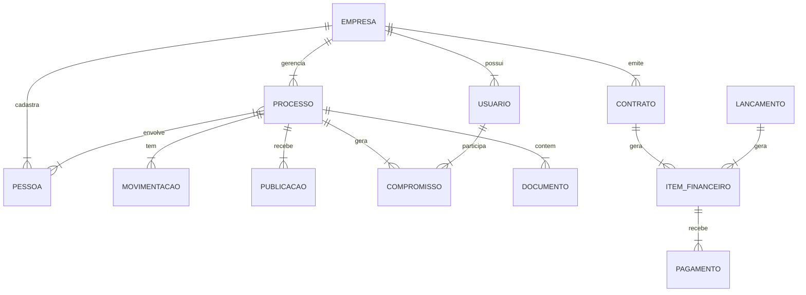

O banco de dados é relacional (PostgreSQL) e utiliza UUIDs para chaves primárias na maioria das tabelas para facilitar a escalabilidade e migração de dados.

> **Arquivo Fonte Completo**: O esquema exato e atualizado está disponível no arquivo [`schema.prisma`](./schema.prisma) nesta mesma pasta.

## Tabelas Principais

### Núcleo (Core)
- **`empresas`**: Tabela raiz do sistema multi-tenant. Armazena dados dos escritórios/clientes do SaaS.
- **`usuarios`**: Usuários do sistema (advogados, secretárias, administradores). Vinculados a uma ou mais empresas.
- **`roles` / `permissoes`**: Controle de acesso (RBAC). Define o que cada usuário pode fazer.

### Jurídico
- **`processos`**: Tabela central do módulo jurídico. Armazena número do processo, tribunal, vara, valor da causa, etc.
- **`movimentacoes`**: Histórico de andamentos do processo.
- **`publicacoes`**: Publicações oficiais capturadas dos diários de justiça.
- **`processos_pessoas`**: Tabela de ligação (N:N) entre processos e pessoas (partes), definindo o papel (Autor, Réu, Advogado).

### Pessoas (CRM)
- **`pessoas`**: Cadastro unificado de pessoas físicas e jurídicas (clientes, advogados contrários, juízes, etc.).
- **`pessoas_endereco`**, **`pessoas_telefone`**, **`pessoas_email`**: Detalhes de contato normalizados.

### Agenda
- **`compromissos`**: Eventos da agenda (audiências, prazos, reuniões).
- **`evento_participantes`**: Pessoas envolvidas no compromisso.
- **`evento_alertas`**: Configuração de lembretes/notificações.

### Financeiro
- **`fin_contratos`**: Contratos de honorários. Define valores, parcelas e regras de cobrança.
- **`fin_lancamentos_avulsos`**: Receitas e despesas não vinculadas a contratos recorrentes.
- **`fin_itens`**: Parcelas geradas a partir de contratos ou lançamentos. É o que efetivamente gera o "Contas a Pagar/Receber".
- **`fin_pagamentos`**: Registro da baixa (pagamento) de um item financeiro.
- **`contas`**: Contas bancárias ou caixas internos do escritório.
- **`transacoes`**: Extrato financeiro unificado (entradas e saídas).

### Documentos (GED)
- **`documentos`**: Metadados dos arquivos armazenados (S3/Local). Vinculados a processos, pessoas ou empresas.

## Diagrama de Relacionamento Simplificado

## Convenções
- **Chaves Primárias**: UUID (v4) na maioria das tabelas novas.
- **Timestamps**: `criado_em` e `atualizado_em` (ou `created_at`/`updated_at`) em quase todas as tabelas para auditoria.
- **Soft Delete**: Alguns registros possuem flags como `ativo` ou `status` para indicar exclusão lógica.
