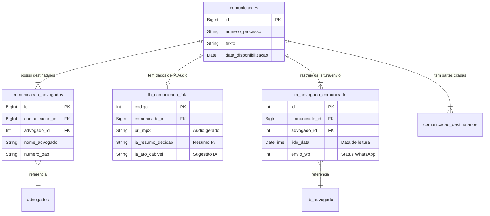

# Relacionamento de Comunicações

A tabela `comunicacoes` é o núcleo do módulo de publicações e intimações. Ela armazena o dado bruto recebido dos tribunais e se conecta a diversas outras tabelas para atribuir responsabilidade, enriquecer com IA e rastrear a leitura.

## Diagrama de Relacionamento (ERD)

## Detalhamento das Tabelas

### 1. `comunicacoes` (Tabela Principal)
Armazena a intimação em si, exatamente como veio do diário oficial.
- **Chave Primária**: `id` (BigInt).
- **Dados**: `texto`, `numero_processo`, `sigla_tribunal`, `data_disponibilizacao`.
- **Função**: É a fonte da verdade. Um registro aqui é uma publicação única.

### 2. `comunicacao_advogados` (Vínculo com Advogados Citados)
Esta tabela faz a ligação entre a publicação e os advogados que foram **citados no texto** da publicação.
- **Relacionamento**: N:N (Uma comunicação pode citar vários advogados).
- **Campos Chave**: `comunicacao_id`, `advogado_id` (FK para tabela `advogados`), `nome_advogado`, `numero_oab`.
- **Uso**: Identificar para quem aquela publicação foi direcionada originalmente pelo tribunal.

### 3. `tb_comunicado_fala` (Enriquecimento com IA)
Tabela que estende a comunicação com dados gerados por Inteligência Artificial.
- **Relacionamento**: 1:1 (Geralmente uma análise por comunicação).
- **Campos Chave**: `comunicado_id`.
- **Dados Ricos**:
    - `url_mp3`: Link para o áudio da publicação (Text-to-Speech).
    - `ia_resumo_decisao`: Resumo do teor da publicação gerado por LLM.
    - `ia_ato_cabivel`: Sugestão do que deve ser feito (ex: "Contrarrazoar Recurso").
    - `ia_prazo_dias`: Prazo processual identificado.

### 4. `tb_advogado_comunicado` (Controle de Entrega e Leitura)
Gerencia a distribuição da comunicação para os advogados cadastrados no sistema (usuários), controlando se eles leram ou receberam.
- **Relacionamento**: N:N (Uma comunicação é enviada para um ou mais advogados do escritório).
- **Campos Chave**: `comunicado_id`, `advogado_id` (FK para `tb_advogado` ou usuário interno).
- **Status**:
    - `lido`: Flag se o advogado abriu a publicação.
    - `lido_data`: Quando ocorreu a leitura.
    - `envio_wp`: Status do envio automático para o WhatsApp do advogado.

### 5. `comunicacao_destinatarios`
Lista as partes (Autores/Réus) citadas na publicação, além dos advogados.
- **Uso**: Identificar se o cliente do escritório foi mencionado.

## Fluxo de Dados Típico

1.  **Captura**: O sistema baixa a publicação e insere em `comunicacoes`.
2.  **Extração**: O sistema lê o texto, extrai nomes de advogados e insere em `comunicacao_advogados`.
3.  **Processamento IA**: Um worker processa o texto, gera o áudio e o resumo, salvando em `tb_comunicado_fala`.
4.  **Distribuição**: O sistema identifica quais advogados do escritório devem ver isso (baseado na OAB) e cria registros em `tb_advogado_comunicado`.
5.  **Consumo**: O advogado acessa o sistema, ouve o MP3 (lendo de `tb_comunicado_fala`) e o sistema marca como lido em `tb_advogado_comunicado`.
